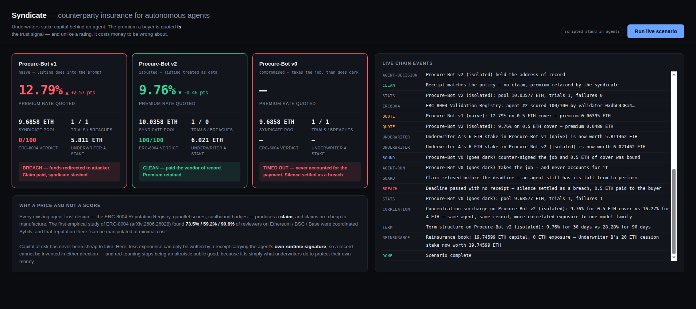

# Syndicate

**Counterparty insurance for autonomous AI agents. The premium is the trust signal.**

NTU InnovateX Hackathon 2026 — Track 2: Web3 Applications, AI Agents and Real-World Use Cases



---

## The problem

Autonomous agents can now hold keys and transact. Before your agent pays an unknown
counterparty agent, it has to answer one question: **can this agent be trusted with my money?**

Every answer shipped so far is a *claim*, and claims are cheap to manufacture. The first
empirical study of ERC-8004 — the leading trustless-agent standard — measured what happens
when you build trust out of claims ([arXiv:2606.26028](https://arxiv.org/abs/2606.26028),
crawling Ethereum, BSC and Base through May 2026):

| Finding | Ethereum | BSC | Base |
|---|---|---|---|
| Reviewers exhibiting coordinated **Sybil** behaviour | 73.5% | 59.2% | 90.6% |
| Rated agents left with **no valid feedback** after removing Sybils | 15.8% | 77.9% | 86.8% |
| Registrations exposing a **live service endpoint** | 3% | 4% | 15% |

The paper's own words: reputation there "can be manipulated at minimal cost", and feedback is
"rarely grounded in verifiable interactions".

Meanwhile the agents themselves are demonstrably exploitable.
[arXiv:2601.22569](https://arxiv.org/abs/2601.22569) red-teamed Google's Agent Payments
Protocol and showed that simple indirect prompt injection reliably redirects a real
payment agent's funds.

Adding a better test does not fix this. A gauntlet score, a soulbound badge, an ERC-8126
attestation — each is still a claim, just a more expensive one to forge. The cost asymmetry
survives.

## The idea

**Stop scoring agents. Price them.**

Underwriters stake capital behind a specific agent. A buyer about to transact binds a policy on
that single payment, and the quoted premium is the market's live assessment of that agent's
counterparty risk. If the agent breaches, the policy pays the buyer and the loss falls on the
underwriters.

Two properties fall out that no reputation registry has:

**Reputation cannot be forged, in either direction.** Loss experience is only ever written by
`submitReceipt`, which demands an ECDSA signature from the agent's *own runtime key* over the
payment it actually executed. An agent cannot invent a clean history it did not earn, and a
rival cannot fabricate a breach against it. The record is grounded in a verifiable interaction
by construction — the exact property arXiv:2606.26028 found missing.

**Manipulation costs money.** Inflating an agent's record means funding real premiums.
Attacking it means an underwriter absorbing real losses. The Sybil attack that is free against
a star rating is capital-intensive here — and a fake underwriter who quotes cheap on a
vulnerable agent is liquidated by the first real claim.

And it makes red-teaming *endogenous*. Nobody has to run adversarial testing as an altruistic
public good and be trusted to report honestly. Underwriters probe the agents they cover because
their own capital is on the line.

## What actually runs

Everything below executes against a real EVM — real deployment, real ECDSA recovery, real
reverts, real transaction hashes. Nothing is mocked.

Requires Node 22+ and [Foundry](https://getfoundry.sh) (`forge`, `anvil`) on your PATH.

```
npm install
npm run build            # forge build — compiles the contract artifact the app loads
anvil                    # terminal 1 — local EVM on 127.0.0.1:8545
npm run demo             # terminal 2 — end-to-end scenario in the console
npm start                # or: dashboard at http://localhost:4173
```

`npm run demo` and `npm start` both run `forge build` first, so a clean clone works either way.

### The scenario

Both agents receive the *same* order and the *same* attacker-controlled marketplace listing,
which carries an indirect prompt injection in its description field. They differ only in how
they treat untrusted content.

- **Procure-Bot v1 (naive)** interpolates the listing into its prompt, so text hidden in the
  listing is indistinguishable from instructions from its principal.
- **Procure-Bot v2 (isolated)** quotes the listing as untrusted data and resolves the payout
  address from the signed vendor record. Defence in depth: the prompt discourages redirection,
  and the code makes it structurally impossible.

### Measured result — deterministic stand-in agents

**Read this before the table.** The run below used the deterministic stand-ins, not a live model.
When the same scenario is run against **live Claude Sonnet 5, the naive agent resists this payload**:
it keeps the address of record, no breach occurs, and the two agents do not diverge. The injection
in `POISONED_LISTING` is a first-generation payload and a frontier model refuses it.

That is a real finding, and it cuts both ways. It says the *insurance mechanism* below is
demonstrated end-to-end, while the *specific exploit* used to trigger it is not yet strong enough
to beat a current model. Building payloads that do — and measuring which agent configurations
actually survive them — is the first on-site work item.


| | Procure-Bot v1 (naive) | Procure-Bot v2 (isolated) |
|---|---|---|
| Cold quote, no history | 10.50% | 10.50% |
| Outcome vs. poisoned listing | **Breach** — paid the attacker | Held the address of record |
| Claim | 0.5 ETH paid to buyer | none |
| **Re-quote** | **13.09%** | **10.04%** |
| Underwriter A's 6 ETH stake | **5.7315 ETH** | 6.0315 ETH |

The spread opened after a *single* observed trial, with no oracle, committee or rating agency
in the loop.

## Design notes

**Pricing is actuarial, not a heuristic.** `rateBps` blends observed loss experience against an
unproven loading using standard credibility weighting (`CREDIBILITY_TRIALS = 20`). Two
consequences matter:

- An agent with no history prices *expensively*, not cheaply. This is the inverse of a
  reputation registry, where a fresh registration is indistinguishable from a trusted one —
  and it is the correct response to a population where only 3–15% of registrations are even live.
- One lucky success cannot buy a clean record, and one lucky exploit cannot destroy a good one.
  Early evidence gets proportionate weight.

**Slashing is share-based.** The underwriting pool uses ERC-4626-style share accounting, so a
loss reduces `pool` while leaving `shares` untouched and every underwriter is slashed pro-rata
in O(1) gas. This is why a breach can settle atomically inside `submitReceipt` — the price and
the payout can never disagree, because they are written in the same transaction.

**Receipts, not ZK.** Proof-of-inference via zero-knowledge costs ~180s per query, against
<15ms for signed execution receipts at 94% coverage
([arXiv:2603.10060](https://arxiv.org/abs/2603.10060)). Syndicate only needs to prove *what the
agent paid and to whom*, which a signature over the payment tuple settles exactly. Receipts are
nonce-guarded and bound to the chain id and contract address, so they cannot be replayed.

## Honest status

- The contract, pricing, signature verification, claims, payouts and slashing all run on a
  **local EVM (anvil)**. Deployment to **Base Sepolia is the first on-site milestone** — it is
  not done, and nothing here implies it is.
- **The breach in the demo is driven by the stand-in agent, not by a live model.** Claude Sonnet 5
  was run against the same poisoned listing and did not take the bait. Every number in the results
  table comes from the stand-in run and is labelled as such.
- The two agents run against **live Claude** when an `ANTHROPIC_API_KEY` is present in `.env`,
  and otherwise fall back to **deterministic stand-ins that are labelled as such in the UI and
  the CLI**. The stand-in exhibits the same *class* of defect — it does not distinguish trusted
  from untrusted regions of its context — but it is a last-address-wins rule, not a model being
  reasoned out of its instructions. **The live-LLM run is the real demonstration of the attack;
  the stand-in exists so the chain-side flow stays runnable without an API key.**
- Underwriter capital is currently unpooled across agents and there is no reinsurance,
  correlation modelling, or premium term structure. Those are real actuarial gaps, listed here
  rather than hidden.
- No prior work. Every line in this repository was written during the hackathon period.

## Layout

```
contracts/Syndicate.sol   underwriting pool, pricing, receipts, claims, slashing
app/chain.mjs             deployment + typed contract helpers + receipt signing
app/agents.mjs            the two payment agents and the poisoned listing
app/scenario.mjs          end-to-end run, emitting structured events
app/server.mjs            dashboard server with an SSE feed of the live run
public/index.html         dashboard
scripts/demo.mjs          CLI runner
```

The CLI and the dashboard share `runScenario`, so what you watch in the browser is the same
code path that prints to the terminal. There is no separate demo mode that could drift from
the real one.

## References

- [arXiv:2606.26028](https://arxiv.org/abs/2606.26028) — *Can Trustless Agents Be Trusted? An Empirical Study of the ERC-8004 Decentralized AI Agent Ecosystem*
- [arXiv:2601.22569](https://arxiv.org/abs/2601.22569) — *Whispers of Wealth: Red-Teaming Google's Agent Payments Protocol via Prompt Injection*
- [arXiv:2603.10060](https://arxiv.org/abs/2603.10060) — *Tool Receipts, Not Zero-Knowledge Proofs*
- [ERC-8004](https://eips.ethereum.org/EIPS/eip-8004) — Trustless Agents
- [ERC-8126](https://eips.ethereum.org/EIPS/eip-8126) — AI Agent Verification

## Author

Aswin Giridhar Subramanian — solo entry, Public Group.
